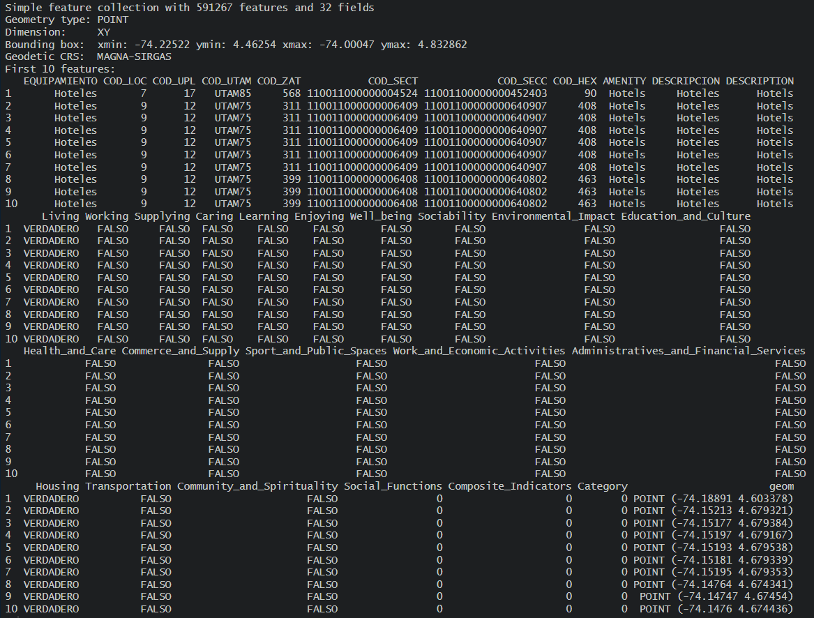
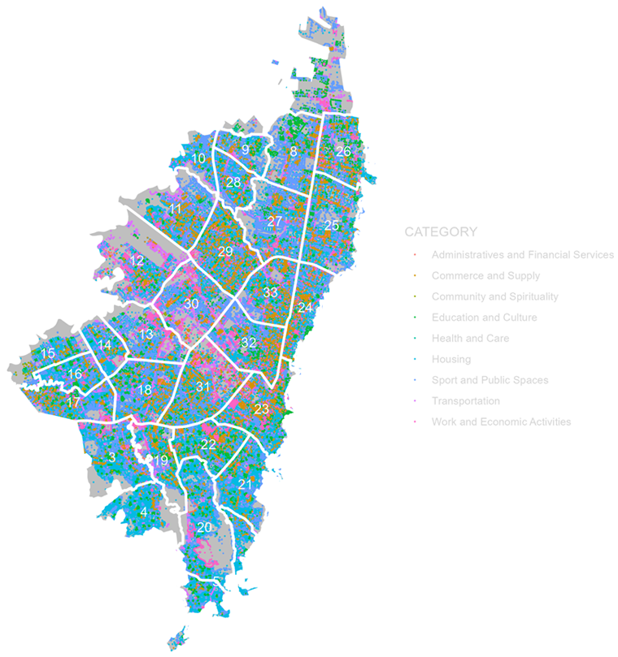
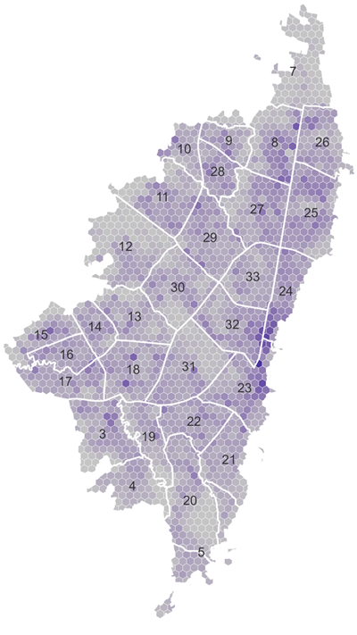
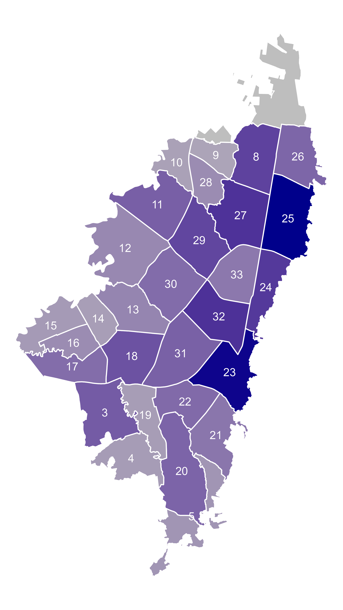
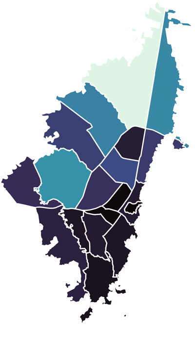

# 4.-Amenities-Query-from-OSM-and-its-Graphical-Representation-for-Bogota

### Script: `4_1_Amenities_Scn1_Eng.R`

## Main Objective

The objective of this script is to query **OpenStreetMap** for the most important facilities located in Bogotá DC, Colombia. The query is performed for 102 main types of facilities, organized into 9 main categories, as well as 5 social functions and 3 composite indicators used in the 15-minute city concept.

## Key Processes and Outputs

The script executes the following fundamental operations:
* Load source data processed in the previous scripts **[1_Geospatial_Standardisation_Bogota](https://github.com/ssilveram/1.-Standardisation-of-Geospatial-Layers-for-Bogota/tree/main)** and **[2_Population Bogota](https://github.com/ssilveram/1.-Standardisation-of-Geospatial-Layers-for-Bogota/tree/main)**.
* Load the amenities classification from the csv file OSM_Categories_CSV.csv
* Make the request to OSM for each type of amenity.
* Due the information of the Apartment, House and other amenities related with Housing, it's complemented and corrected with data from the Population's script results.
* Create Point maps for amenities (All, by Category and by Amenity).
* Create Hexagon -HEX- maps for grouped amenities (All, by Category and by Amenity).
* Create Local Planning Unit -UPL- maps for grouped amenities (All, by Category and by Amenity).
* Create Localities -LOC- maps for grouped amenities (All, by Category and by Amenity).

Upon completion, the processed data is **exported to a standard geospatial format** (e.g., GeoPackage), and additionally, **cartographic visualisations (maps) are generated** to validate the results.

## Prerequisites

Before running this script, please ensure you meet the following requirements:

1. It's recommended to install the `pacman` package, which installs the libraries needed to run the scripts. All step-by-step details are included as comments within the code. The scripts are fully annotated in Spanish, as they are also intended to be shared with Colombian agencies and authorities.

2.  **Initialisation Script:** It is essential to run the `0_Initialization.R` script that accompanies this repository. This file is also used by other scripts within the Master's Thesis Project on Mobility in Bogotá. It centralises the loading of R libraries, the definition of custom functions, and the configuration of the working environment, ensuring consistency between this and other related analyses.

3.  **Data Sources:** The source geospatial layers, and population are not included in this repository. It's highly recommended run the scripts `1_Geospatial_Standardisation_Bogota.R` and `2_Population.R` included in the Main folder. For details to run each of this scripts, please refer to **[1_Geospatial_Standardisation_Bogota](https://github.com/ssilveram/1.-Standardisation-of-Geospatial-Layers-for-Bogota/tree/main)** and **[2_Population Bogota](https://github.com/ssilveram/1.-Standardisation-of-Geospatial-Layers-for-Bogota/tree/main)** to get the necessary formatted data to run this script correctly.
  
## Sample of results

### Sample of structured output data:

### Sample of output maps:

The following maps are rendered in low resolution. Fot high resolution and detailed maps by category and type of amenities, please refer to **[Detailed Maps](https://github.com/ssilveram/4.-Amenities-Query-from-OSM-and-its-Graphical-Representation-for-Bogota/tree/main/Detailed_Maps)** folder.

**Location map of amenities (points):**

**Desity map of amenities by Hexagon (HEX):**

**Density map of Amenities by Local Planing Unit (UPL):**

**Density map of Amenities by Locality (LOC):**

## Technologies used

**[R](https://cran.rstudio.com/)**: Version 4.3.3.

**[RStudio](https://posit.co/download/rstudio-desktop/)**: Version 2025.05.0.

Data sources: [OpenStreetMap](https://www.openstreetmap.org), [Mapas de Bogotá](https://mapas.bogota.gov.co/), [Secretaría Distrital de Movilidad](https://www.movilidadbogota.gov.co/), and [Departamento Administrativo Nacional de Estadística - DANE](https://www.dane.gov.co/).

---

