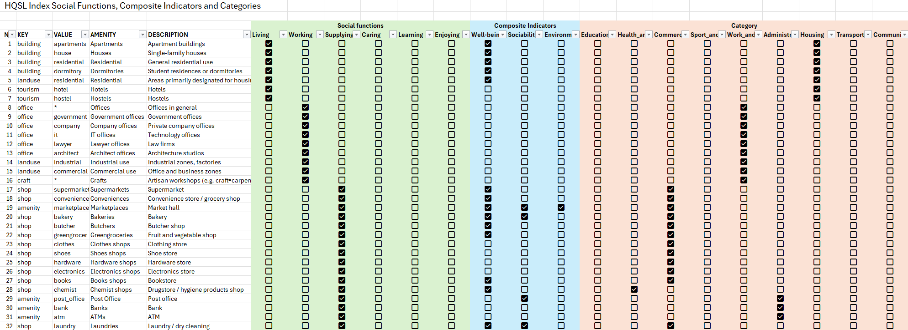
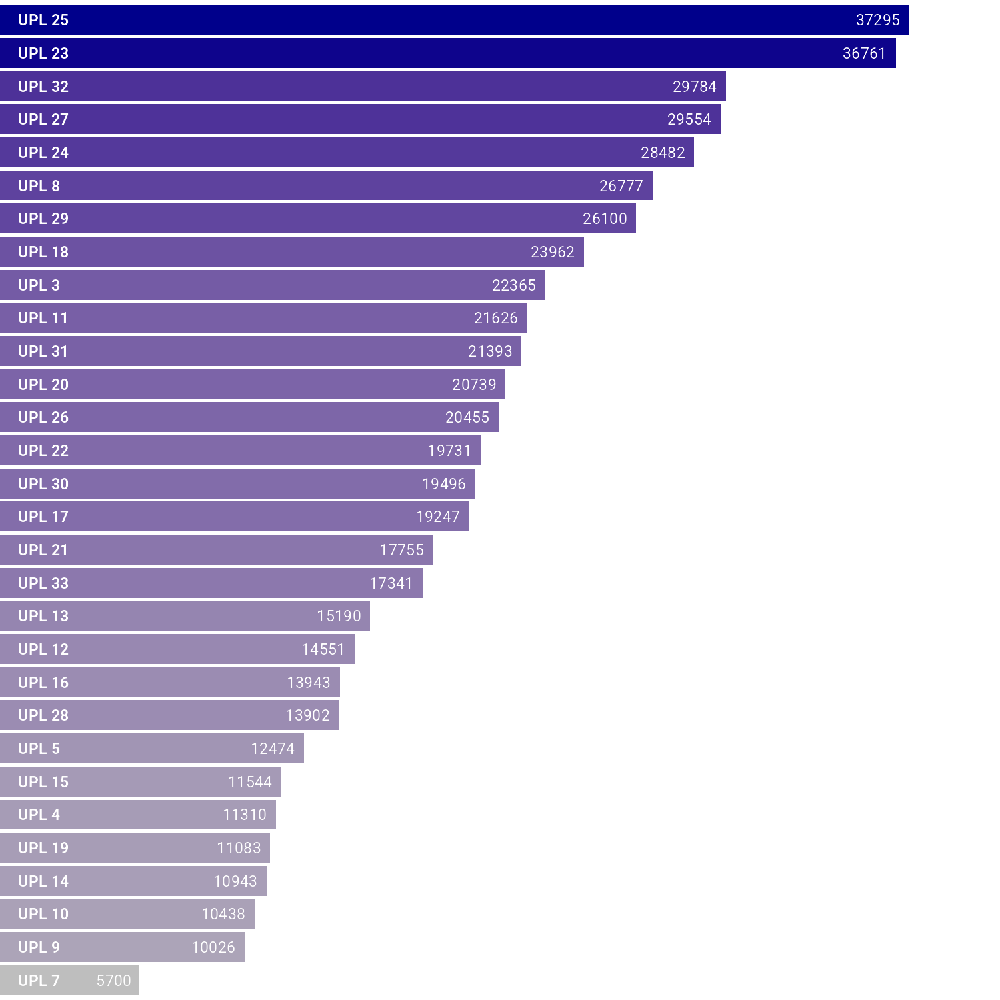
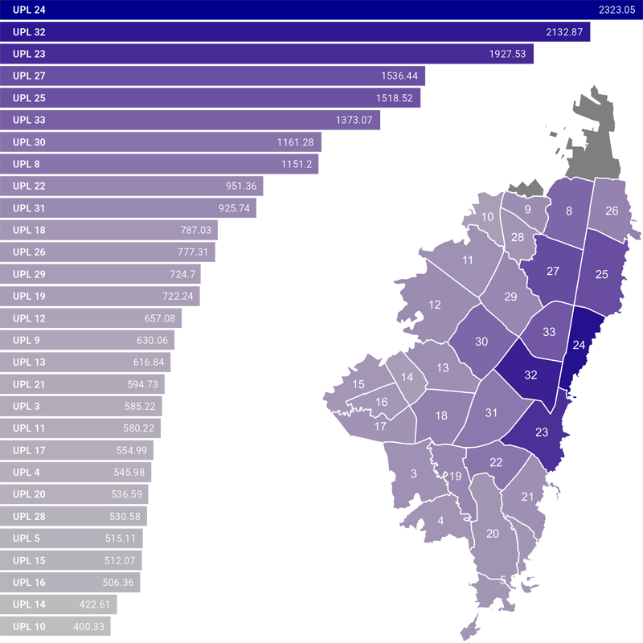

# 4.-Amenities-Query-from-OSM-and-its-Graphical-Representation-for-Bogota

### Script: `4_1_Amenities_Scn1.R`

## Main Objective

The objective of this script is to query **OpenStreetMap** for the most important facilities located in Bogotá DC, Colombia. The query is performed for 102 main types of facilities, organized into 9 main **Categories**, as well as 5 **Social functions** and 3 **Composite indicators** used in the 15-minute city concept. The query script 4_1_Amenities_Scn1.R is part of a series of scripts that comprise the Proximity Analysis for the City of Bogotá. "Scn1" refers to the current scenario. Subsequent scripts (7 in total) will implement new amenities where a shortage is identified.

## Key Processes and Outputs

The script executes the following fundamental operations:
* Load source data processed in the previous scripts **[1_Geospatial_Standardisation_Bogota](https://github.com/ssilveram/1.-Standardisation-of-Geospatial-Layers-for-Bogota/tree/main)** and **[2_Population Bogota](https://github.com/ssilveram/1.-Standardisation-of-Geospatial-Layers-for-Bogota/tree/main)**.
* Load the amenities classification from the csv file OSM_Categories_CSV.csv
* Make the request to OSM for each type of amenity.
* Due the information of the Apartment, House and other amenities related with Housing, it's complemented and corrected with data from the Population's script results.
* Create Point maps for amenities (All, by Category and by Amenity).
* Create Hexagon -HEX- maps for grouped amenities (All, by Category and by Amenity).
* Create Local Planning Unit -UPL- maps for grouped amenities (All, by Category and by Amenity).
* Create Localities -LOC- maps for grouped amenities (All, by Category and by Amenity).

Upon completion, the processed data is **exported to a standard geospatial format** (e.g., GeoPackage), and additionally, **cartographic visualisations (maps) are generated** to validate the results.

## Prerequisites

Before running this script, please ensure you meet the following requirements:

1. It's recommended to install the `pacman` package, which installs the libraries needed to run the scripts. All step-by-step details are included as comments within the code. The scripts are fully annotated in Spanish, as they are also intended to be shared with Colombian agencies and authorities.

2.  **Initialisation Script:** It is essential to run the `0_Initialization.R` script that accompanies this repository. This file is also used by other scripts within the Master's Thesis Project on Mobility in Bogotá. It centralises the loading of R libraries, the definition of custom functions, and the configuration of the working environment, ensuring consistency between this and other related analyses.
   
3.  **OSM_Categories_CSV.csv:** This file contain the ammenities classification by **Category**, **Social Function** and **Composite Indicator** for each type of amenity. Keys and values the OSM queries are also included. The following image shows the table structure of the CSV file, included in the repository:

4.  **Data Sources:** The source geospatial layers, and population are not included in this repository. It's highly recommended run the scripts `1_Geospatial_Standardisation_Bogota.R` and `2_Population.R` included in the Main folder. For details to run each of this scripts, please refer to **[1_Geospatial_Standardisation_Bogota](https://github.com/ssilveram/1.-Standardisation-of-Geospatial-Layers-for-Bogota/tree/main)** and **[2_Population Bogota](https://github.com/ssilveram/1.-Standardisation-of-Geospatial-Layers-for-Bogota/tree/main)** to get the necessary formatted data to run this script correctly.
  
## Sample of results

### Sample of structured output data:

### Sample of output maps:

The following maps are rendered in low resolution. For high resolution and detailed maps by category and type of amenities, please refer to **[Detailed Maps](https://github.com/ssilveram/4.-Amenities-Query-from-OSM-and-its-Graphical-Representation-for-Bogota/tree/main/Detailed_Maps)** folder.

**Location map of amenities (points):**

**Density map of amenities by Area:**

The density maps of amenities can be created in any of the different administrative areas of the city showed in [1.-Standardisation-of-Geospatial-Layers-for-Bogota](https://github.com/ssilveram/1.-Standardisation-of-Geospatial-Layers-for-Bogota): Municipality (MPIO), Locality (LOC), Local Planning Unit (UPL), Territorial Units for Mobility Analysis (UTAM), Transport Analysis Zones (ZAT), Sectors (SECT), Sections (SECC), 500m diameter hexagonal grid (HEX). Following you can find the largest administrative area LOC and, and the second smallest of the areas: HEX.

 

**Amenities by Local Planning Unit (UPL):**

**Amenities by each 10k Inhabitants:**

**Example of how show the amenities deficit in some UPLs in Bogota. Universities by UPL:**

### 3D Rendering maps ###

Sometimes it can be useful to create 3D maps to better visualise the details. Some 3D maps have been created and can be found in the **[Detailed Maps](https://github.com/ssilveram/4.-Amenities-Query-from-OSM-and-its-Graphical-Representation-for-Bogota/tree/main/Detailed_Maps)** folder. Below are two 3D maps created with this script: 1) Number of universities per hexagon area, and 2) Number of jobs per 10,000 workers living in the locality (LOC). The function for creating the 3D maps is included in the `0_Initialization.R` initialization script, which is part of this repository. 

 

Unfortunately, the resulting images, generated by the 3D map creation process and subsequent ray tracing, cannot be created as PNGs with a transparent background. This is why the resulting images have a white background.

## Technologies used

**[R](https://cran.rstudio.com/)**: Version 4.3.3.

**[RStudio](https://posit.co/download/rstudio-desktop/)**: Version 2025.05.0.

Data sources: [OpenStreetMap](https://www.openstreetmap.org), [Mapas de Bogotá](https://mapas.bogota.gov.co/), [Secretaría Distrital de Movilidad](https://www.movilidadbogota.gov.co/), and [Departamento Administrativo Nacional de Estadística - DANE](https://www.dane.gov.co/).

---

